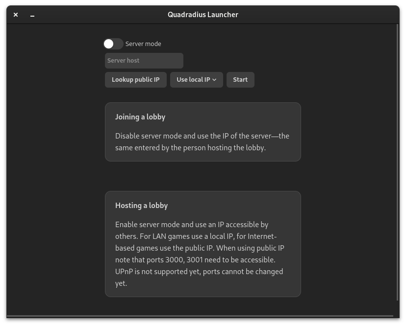

# Quadradius Preservation Project
[](https://github.com/Fruktus/QuadradiusPreservationProject/releases)
[](https://www.python.org/downloads/)
[](https://github.com/Fruktus/QuadradiusPreservationProject/actions/workflows/launcher.yml)
[](https://github.com/Fruktus/QuadradiusPreservationProject/actions/workflows/server.yml)
[](https://github.com/Fruktus/QuadradiusPreservationProject/releases)
[](https://www.reddit.com/r/quadradius/)
[](https://discord.gg/cVkV8pah4d)

The goal of this project is to keep this game alive.
The software contained in this repository is a reimplementation of the original server, which was written in Java.
Some functionalities may be missing, if so, please report them using the [Issues](https://github.com/Fruktus/QuadradiusPreservationProject/issues) page.

The website `classic.quadradius.com` is no longer available and the only way to obtain the client files is through archives or in our [Quadradius Classic Backup](https://github.com/Fruktus/QuadradiusClassic) repo.
The project is non-profit.
All of the rights belong to the original authors, Jimmi Heiserman and Brad Kayal with whom we are not affiliated.
The provided software does not represent the quality of the original,
and the original authors should in no way be held accountable for any liabilities.

## Where to play
You can play the current build at [quadradius.ddns.net](https://quadradius.ddns.net/).
At the moment there is no authentication and the usernames and passwords aren't stored, you can use whatever nickname and random password you'd like.
In the future we will most likely add some way to register to enable ranked play.
The game is and will be free to play.
If you'd like to discuss anything with us (authors) or fellow players you can join our discord server linked at the top or use [this link](https://discord.gg/cVkV8pah4d).

## Quadradius Launcher

<p align="center">
   
</p>

The launcher is the easiest way to run the application.
Download the appropriate version for your system from [Releases](https://github.com/Fruktus/QuadradiusPreservationProject/releases).
Then run the application within and follow the instructions.
To make the server available outside your LAN, port forwarding will most likely be needed, but this will not be covered here.

Alternatively, you can set the launcher up manually by following the steps from [Manual](https://github.com/Fruktus/QuadradiusPreservationProject/tree/master/launcher)


## Installation from source
If the launcher is not desired, it is possible to install the software manually:
1. From source (by installing Python and dependencies, downloading Ruffle and configuring everything)
2. Via Docker

To run the game, the client is needed.
The Flash emulator, [Ruffle](https://ruffle.rs/), mostly works (with minor inconsistencies) and is the preffered way of running the software.


### Manual installation
Clone or download the repository from GitHub and run
```bash
python -m QRServer
```

You can configure the server by passing the following CLI parameters:
* `-b`/`--bind` — bind address (default `127.0.0.1`),
* `-p`/`--lobby-port` — lobby port (default `3000`),
* `-q`/`--game-port` — game port (default `3001`).

You can also run `python -m QRServer -h` to display help.
You can play as a member by typing in username and any password (it is not checked at the moment).


### Docker and Compose

This repository also contains a `Dockerfile` which creates an image with an HTTP server (serving the client SWF files), and the QR server itself.
There is a Compose configuration which makes setting up the server easy, just run:

```bash
docker compose up
```

However, when you want to run the Docker image without Compose:

```bash
docker run -it \
   -p <lobby port>:3000 \
   -p <game port>:3001 \
   -p <http port>:8000 \
   -e ADDRESS="<address>" \
   -e LOBBY_PORT="<lobby port>" \
   -e GAME_PORT="<game port>" \
   ghcr.io/fruktus/quadradius-preservation-project:<version or latest>
```

The following environment variables configure the server:
* `ADDRESS` — the address which the server will be hosted at,
  by default it's `127.0.0.1`
* `LOBBY_PORT` and `GAME_PORT` — the ports of the application,
  they are used by the client to connect to the server

When the image is running, you can start the game by executing
```bash
./ruffle http://<address>:<http port>/quadradius_lobby.swf
# or
./flashplayer http://<address>:<http port>/quadradius_lobby.swf
```
by default, it will be
```bash
./ruffle http://127.0.0.1:8000/quadradius_lobby.swf
# or
./flashplayer http://127.0.0.1:8000/quadradius_lobby.swf
```

#### Persisting data

Data is stored in directory `/data` in the container.
In order to persist the data between containers, just bind this directory
or create a volume.
